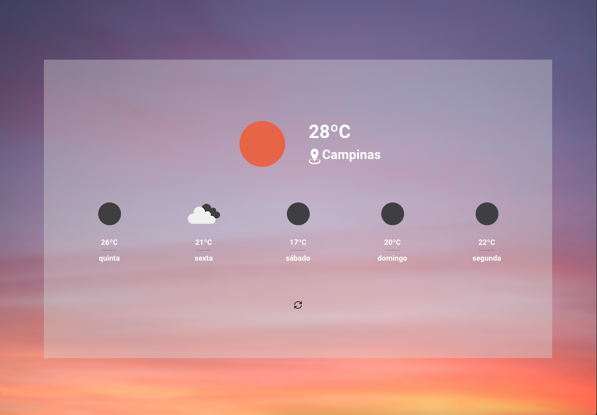

Desafio Técnico web da Builders :rocket:
===

Este desafio técnico foi criado usando [ReactJs](https://github.com/facebook/react/) e seus testes foram escritos usando [Jest](https://jestjs.io).
API utilizada e a da [openweathermap](https://openweathermap.org/api).

## demo

[site](https://builders-wesleysd1989.vercel.app/)



## Como começar a desenvolver e testar este projeto :clipboard:

1. Antes de começar, tenha certeza que seu ambiente está pronto para o desenvolvimento React, de acordo com as instruções oficiais descritas aqui [https://pt-br.reactjs.org/docs/getting-started.html](https://pt-br.reactjs.org/docs/getting-started.html).
2. Clone esse repositório usando o comando ``` git clone < project-url.git > ```.
3. Copie o arquivo ``` .env.example```  para ``` .env```  e preencha as informações.
4. Instale as dependências do projeto usando ``` yarn ```.
5. Use o comando ``` yarn start ``` para iniciar um servidor local.

## Rodando os testes do projeto 🧪

No projeto estamos usando testes unitários que se encontram dentro do diretorio ```__tests__/``` nas pastas.
Os testes do aplicativo são embasados nos frameworks [Jest](https://jestjs.io).
Consideramos um arquivo de teste quando o mesmo tem a extensão ```.test.js```

### Testes Unitários

Para os testes unitarios utilizamos o [Jest](https://jestjs.io) e com ele identificamos problemas em implementações de classes e funções, e possíveis *breaking changes*.
Você pode executar os testes do projeto com o comando ``` yarn run test ```.
A estrutura de pastas dos testes são um espelho da estrutura do diretorio ```src/```, mas se encontram dentro da pasta ```__tests__``` como mencionado acima.

## Boas práticas :thumbsup:

### GIT

#### Nomeando as branches

As branches de desenvolvimento devem ser criadas a partir da branch dev, fazendo o checkout com o comando`git checkout dev`.

1. Caso a branch seja de uma nova feature, crie com o nome `feature/branch-name` com o comando `git checkout -b feature/branch-name`.
2. Caso a branch seja de uma correção, crie com o nome `fix/branch-name` com o comando `git checkout -b fix/branch-name`.
3. Caso a branch seja de uma release, crie com o nome `release/branch-name` com o comando `git checkout -b release/branch-name`.

> Lembre-se de criar o nome das branches em inglês, usando o padrão do ES6, com o nome em minúsculas e separados por hífen.

#### Padrão de commits

Os commits no Git podem ser feito em português e descrevendo bem o que as ações presentes nesse commit. Lembre-se de fazer commits ao menos uma vez ao dia. Você também pode fazer vários commits para separar bem o que está entrando no repositório. Imaginando um commit de correção do texto de um botão, você poderia usar o comando `git commit -m "Corrigindo retorno login"` e o comando `git push` para enviar o código e o commit para o repositório.

Você também pode fazer commits com código 'quebrado' no repositório, lembrando de adicionar as iniciais de `Work In Progress` no início da mensagem do commit, por exemplo: `git commit -m "[WIP] Corrigindo retorno login"`.
